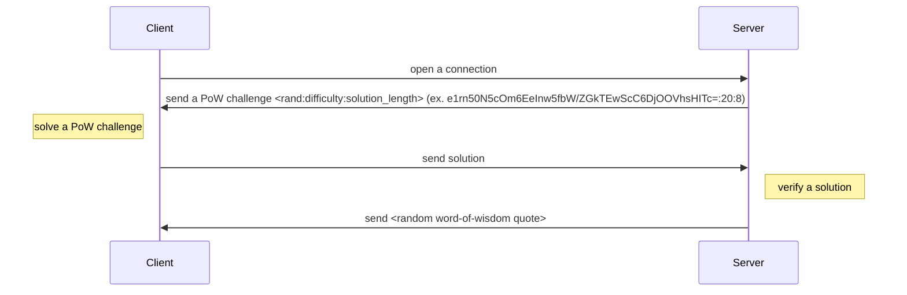

## Workflow


## Chosen algorithm
* bear some resemblance to the ones utilized in numerous cryptocurrencies, including Bitcoin;
* simplicity and comprehensibility are notable. Its implementation only necessitates fundamental procedures such as concatenation and hashing;
* the basis of this algorithm lies in cryptographic hash functions that are intended to withstand different types of attacks. To make it challenging for attackers to generate valid values, the algorithm requires a particular number of zero bytes at the beginning of the hash.

## How to run
### Server
```sh
docker-compose up [--build] server
```

### Client
```sh
docker-compose up [--build] client
```
**Note**: please run `Client` after `Server` have started.